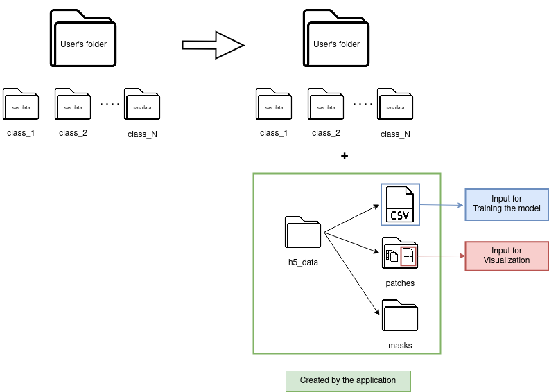
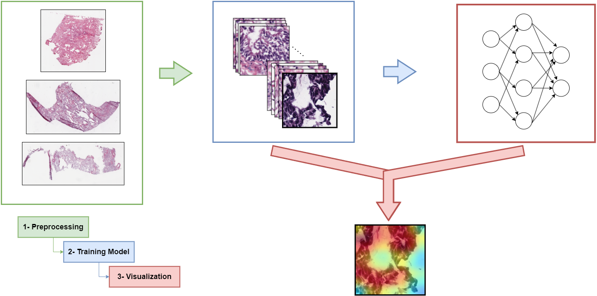

# Application for histopathological image analysis

**Welcome to FPathai** (Friendly PATHology application for Artificial Intelligence), an innovative application tailored for the world of histopathological image analysis 
that breaks down barriers to entry in the world of machine learning.
Without the need for a single 
line of code, this user-friendly tool enables individuals from diverse backgrounds, 
including researchers, medical professionals, and enthusiasts, to effortlessly create 
and train machine learning models using Whole Slide Image (WSI) data. 
Get ready to explore the future of accessible, code-free machine learning in histopathological image analysis.

This library comprises five distinct pages, each serving a specific purpose:

**Homepage**: An introductory page providing an overview of FPathai.

<br>

**Preprocessing**: A page dedicated to generating patches for Whole Slide Images (WSI).

<br>

**Training Model**: A page designed for configuring and training a model using the generated patches.

<br>

**Visualization**: A page dedicated to enhancing the interpretability of patch classification results.

<br>

**Diagnose**: A page for classifying an entire WSI using a pre-trained model.


## Clone the Repository

To clone this repository to your local machine, run the following command in your terminal:

```bash
git clone https://github.com/FernandoPC25/FPathai.git
```
After cloning the repository, navigate to its directory:

## Install dependencies
After cloning the repository, navigate to its directory:

```bash
cd FPathai
```

Next, install the required Python dependencies using pip. You can do this by running:
```bash
pip install -r requirements.txt
```
This will install all the necessary packages listed in the requirements.txt file.

## Usage

The WSI images should be
in ***.svs*** format and can be obtained from [NIH Cancer Datasets](https://portal.gdc.cancer.gov/).

When images in the ***.svs***. format are available on the user's device, they must be reorganized as follows to ensure compatibility with the application:

### Step 1: Create a Main Folder

Begin by creating a main folder on your local machine or storage device. This main folder will serve as the central hub for all your experiment data. Give it a descriptive name that relates to your project.

### Step 2: Class Subfolders

Within the main folder, create subfolders to represent each distinct class or category of your experiment. For example, your classes might be 'Control', 'Tumor', and 'Metastasis'.

### Step 3: Organize with Subfolders
The subfolders will hold the ***.svs***  images that correspond to their respective classes. For doing so, simply place the ***.svs***  into the appropriate sub-subfolders according to their respective classes. This structured organization ensures that your data remains clear and accessible for analysis.




Once the images have been organized in this manner, the application can be utilized seamlessly, **eliminating the necessity for any coding involvement!**




## Contributing
If you'd like to contribute to this project, please follow the Contributing Guidelines.

## License
This project is licensed under the GPL-3.0 license
